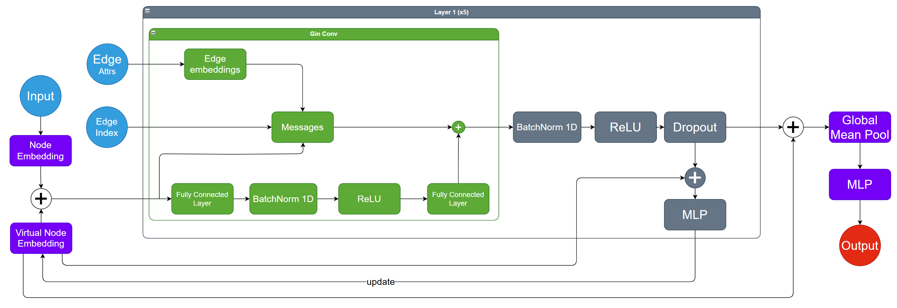

# Virtual Node GNN for Graph Classification



> **Figure:** Architecture of the proposed GNN model with virtual node integration. The figure illustrates the forward pass of the network, including node/virtual node embeddings, stacked GIN layers, and global graph pooling for final prediction. For simplicity, the illustration shows only two layers, although the actual model uses five layers.

---

## 🧠 Overview

This project addresses the task of **graph classification** using a Graph Neural Network (GNN) architecture enhanced with a **Virtual Node** mechanism. The goal is to classify graphs into one of six possible categories, based on their structure and node features.

The model leverages the expressive power of the **GIN (Graph Isomorphism Network)** for local neighborhood aggregation and integrates a **Virtual Node** to efficiently propagate **global information** across the graph.

---

## 📊 Dataset Overview

The dataset used is based on the **OGB (Open Graph Benchmark) ogbg-ppa** dataset, which contains graphs representing **protein-protein associations**. The original dataset includes over 150,000 graphs labeled with **37 classes**, and is commonly used for benchmarking graph classification tasks.

---

## ⚠️ Label Noise Injection

To simulate real-world label imperfections, artificial noise was added to the labels, producing **four different variants** of the dataset:

1. **Symmetric Noise**
2. **Asymmetric Noise**

Each of the four datasets varies by:
- The **type of noise** (symmetric vs. asymmetric).
- The **percentage of noisy labels** injected.

---

## 🎯 Objective

This framework enables an in-depth evaluation of the model’s ability to **handle noisy data**, a key factor in building robust machine learning systems. The modified datasets serve as a valuable benchmark for testing **noise resilience** in GNN-based classifiers.

---

## 🧱 Architecture Details

The core components of the model are:

- **Node Embedding**: Each node is initialized using a learnable embedding layer of dimension 300.
- **Virtual Node Embedding**: A dedicated virtual node with learnable parameters is connected to all graph nodes, allowing efficient propagation of global context.
- **GIN Layers**: 5 stacked GINConv layers are used, each followed by a `BatchNorm1d()` to stabilize training.
- **Virtual Node Updates**: After each GIN layer (except the last), the virtual node is updated through a MLP.
- **Graph Pooling**: After the final GIN layer, node representations are aggregated using **global mean pooling**.
- **Classification Head**: The pooled vector is passed through a final `Linear()` layer for classification into 6 classes.

---

## 📦 Output

The model outputs a **6-dimensional vector**, representing the class logits for graph-level classification.

---

## 🧪 Usage

### 1. Clone the repository

```bash
git clone https://github.com/palu001/Deep-Learning-Hackaton.git
cd Deep-Learning-Hackaton
```
### 2. Install dependencies
```bash
pip install -r requirements.txt
```

### 3. Train the model (default parameters).
### Remember to manually delete the files in the logs and checkpoints directories before starting a new training session.
```bash
python3 main.py --train_path <path_to_train.json.gz> --test_path <path_to_test.json.gz>
```

### 4. Test the model (it uses the best model for each dataset)
```bash
python3 main.py --test_path <path_to_test.json.gz>
```

### You can customize the training. In order to see all parameters use
```bash
python3 main.py -h
```

---

## 📁 Files

Below is a description of the main files and folders in this repository:

- **notebook**: Contains the Kaggle notebook used to train all models. While training can also be executed without it, the reported results were obtained using this notebook.
- **src**: Contains the source code of the project, including models, loss functions, training and testing scripts, etc.
- **submission**: Contains the predicted labels of our best-performing models on the four datasets: A, B, C, and D.
- **checkpoints**: Includes the saved checkpoints of our best models.
- **logs**: Stores training logs for our top models.
- **main.py**: Main script used to launch both training and testing.
- **pth_to_ckpt.py**: Script used to convert `.pth` model files into `.ckpt` format. This was necessary because the notebook uses standard PyTorch, whereas the codebase is implemented in PyTorch Lightning.
- **zipfolder.py**: Utility script to compress the submission folder into a `.gz` file format.


